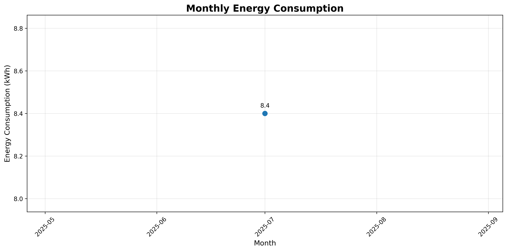
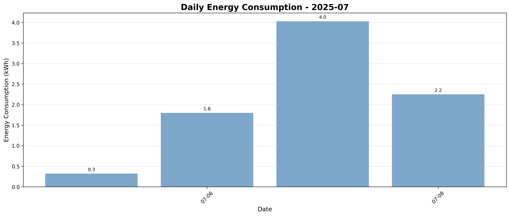

# Energy Consumption Dashboard

## 📊 Consumption Overview

**Latest Reading:** 467.98 kWh at 2025-07-08 23:01:09 UTC  
**Total Consumption:** 8.40 kWh  
**Monitoring Period:** 1 months  

## 📈 Yearly Consumption Trends

## 📅 Daily Consumption (Current Month)

## 📋 Data Structure

### Daily Data (`daily/`)
- Individual CSV files for each day: `energy_YYYY-MM-DD.csv`
- Contains hourly readings with timestamp, energy total, and metadata
- New file created automatically for each day

### Monthly Summaries (`monthly/`)
- Monthly summary files: `energy_summary_YYYY-MM.csv`
- Contains daily summaries and statistics
- Updated automatically as new data arrives

### Graphs (`graphs/`)
- `yearly_consumption.png`: Monthly consumption trends
- `daily_consumption_YYYY-MM.png`: Daily consumption for each month

### Latest Reading (`latest_reading.json`)
- Always contains the most recent energy reading
- Updated every hour
- Easy to parse for current status

## 📊 Data Columns

**Daily Files:**
- `timestamp`: Full datetime in UTC
- `date`: Date (YYYY-MM-DD)
- `time`: Time (HH:MM:SS)
- `forward_energy_total_kwh`: Energy reading in kWh
- `hour`: Hour of day (0-23)
- `day_of_week`: Day name (Monday, Tuesday, etc.)
- `unix_timestamp`: Unix timestamp for easy processing

**Monthly Files:**
- `date`: Date (YYYY-MM-DD)
- `day_of_week`: Day name
- `latest_reading_kwh`: Latest energy reading for that day
- `last_updated`: When the data was last updated
- `readings_count`: Number of readings for that day

## 🔄 Automated Collection

Data is automatically collected every hour using GitHub Actions.

## 📈 Consumption Calculation

- **Monthly Consumption**: Difference between last reading of the month and first reading of the month
- **Daily Consumption**: Difference between last reading of the day and last reading of the previous day

Last updated: 2025-07-08 23:01:10 UTC
